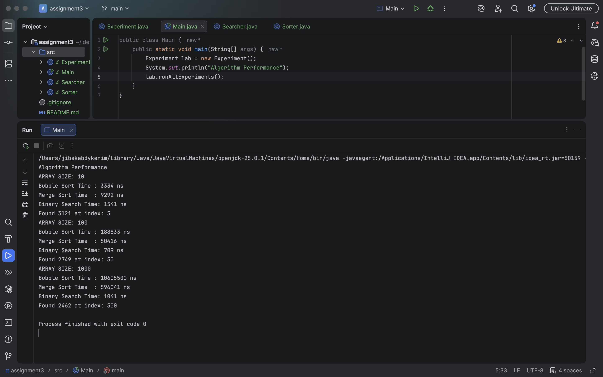

# Assignment 3

**Student:** Zhibek Abdikerim

**Group:** BDA-2504

## 1.Project Overview
This project focuses on implementing and analyzing fundamental sorting and searching algorithms in Java. The goal is to compare their performance using execution time.

## 2.Algorithm Descriptions

1. **Bubble Sort:** Simple comparison-based algorithm that repeatedly steps through the list, compares elements, and swaps them if they are in the wrong order.
Complexity: $O(n^2)$
2. **Merge Sort:** Divide-and-conquer algorithm that divides the array into halves, recursively sorts them, and then merges the sorted halves.
   Complexity: $O(n \log n)$
3. **Binary Search:** Search algorithm that finds the position of a target value within a sorted array by repeatedly dividing.
   Complexity: $O(\log n)$

## 3.Results

| Size | Input Type | Bubble Sort | Merge Sort | Binary Search |
| :--- | :--- |:------------|:-----------|:--------------|
| 10 | Random | 3334ns      | 9292ns     | 1541ns        |
| 100 | Random | 188833ns    | 50416ns    | 709ns         |
| 1000 | Random | 10605500ns  | 596041ns   | 1041ns        |

## 4.Screenshot

## 5.Conclusion
During this assignment, I learned that theoretical Big-O complexity predicts how algorithms scale. While Bubble Sort is easy to write, its $O(n^2)$ nature makes it unusable for large dataset. Merge Sort was much more consistent. The biggest challenge was ensuring Binary Search received a sorted array, as it would fail if not.